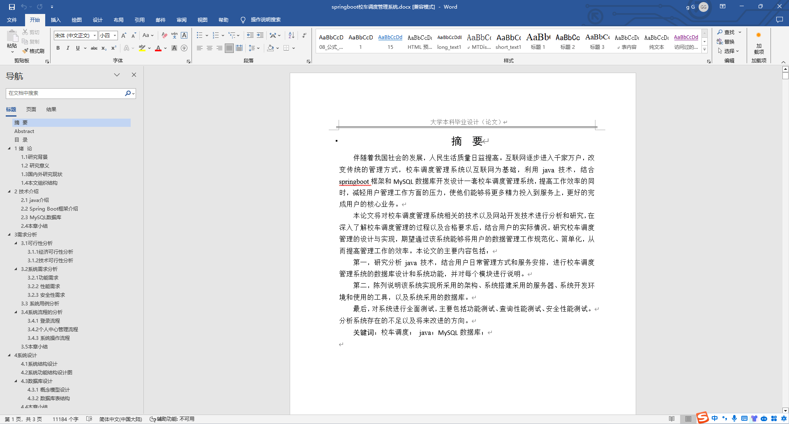
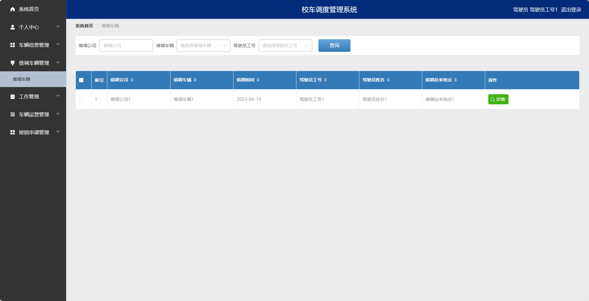
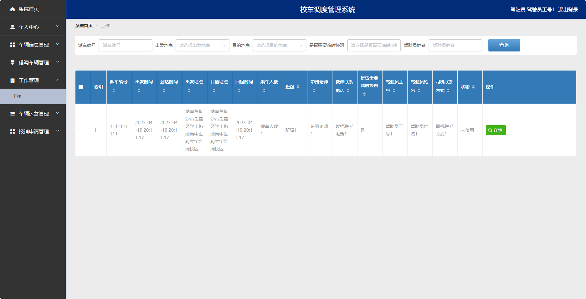
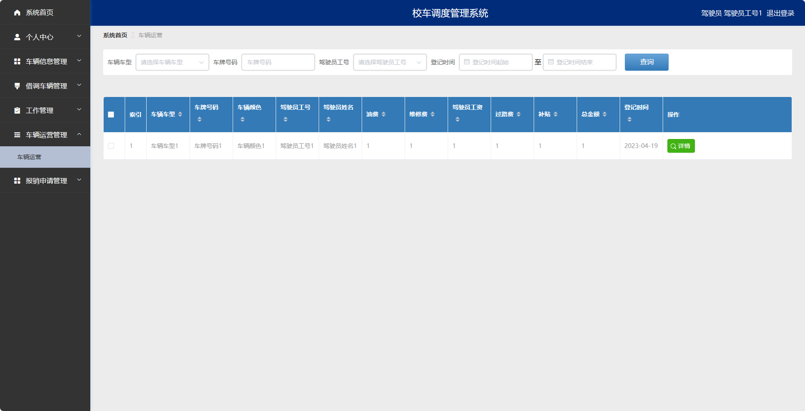
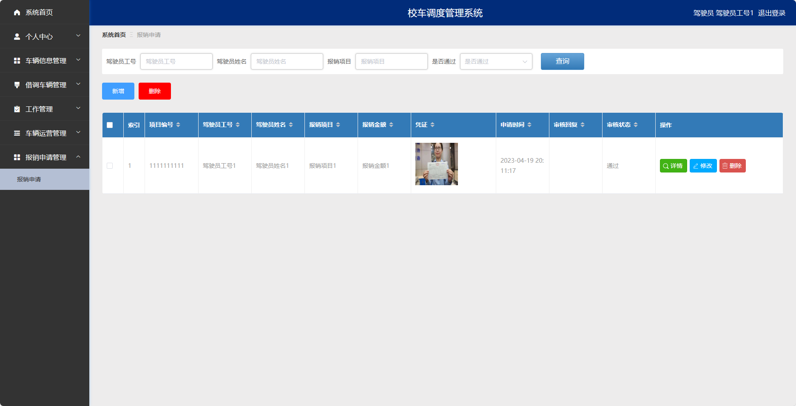
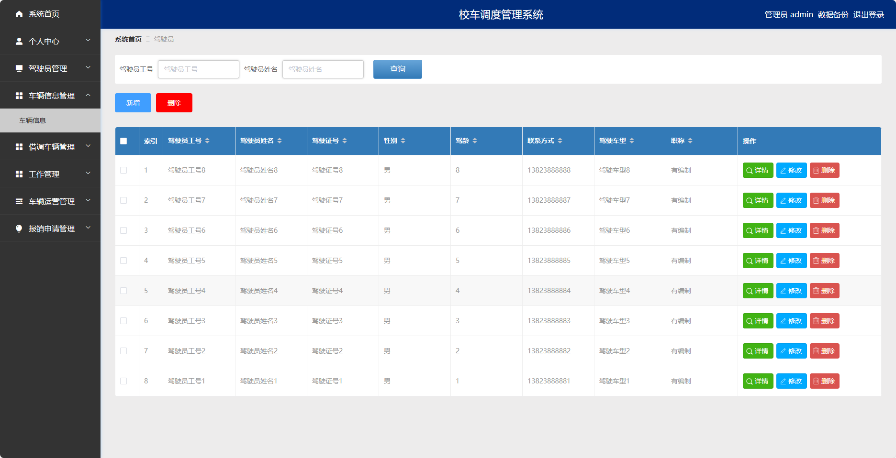
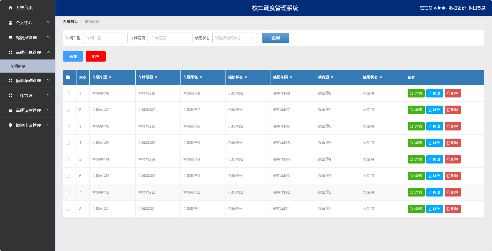
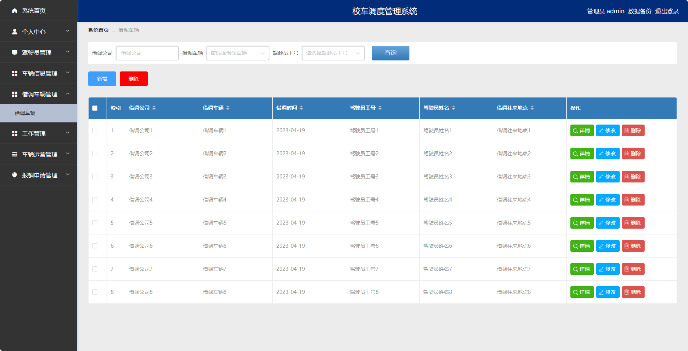
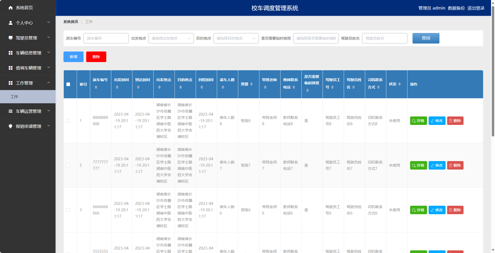

## 基于SpringBoot的校车调度管理系统(程序+报告)

- <b>完整代码获取地址：从戎源码网 ([https://armycodes.com/](https://armycodes.com/))</b>
- <b>技术探讨、资料分享，请加QQ群：692619798</b> 
- <b>作者微信：19941326836  QQ：952045282</b> 
- <b>承接计算机毕业设计、Java毕业设计、Python毕业设计、深度学习、机器学习</b>
- <b>选题+开题报告+任务书+程序定制+安装调试+论文+答辩ppt 一条龙服务</b>
- <b>所有选题地址 ([https://github.com/YuLin-Coder/AllProjectCatalog](https://github.com/YuLin-Coder/AllProjectCatalog)) </b>

## 项目介绍
基于SpringBoot的校车调度管理系统，系统包含两种角色：管理员、用户,系统分为前台和后台两大模块，主要功能如下。

### 【管理员】:
- 个人中心：管理员可以管理个人信息，修改密码等。
- 驾驶员管理：管理员可以对驾驶员信息进行增删改查等操作。
- 车辆信息管理：管理员可以管理车辆的基本信息。
- 借调车辆管理：管理员可以管理车辆的借调情况。
- 工作管理：管理员可以管理驾驶员的工作排班。
- 车辆运营管理：管理员可以管理车辆的运营情况。
- 报销申请管理：管理员可以管理报销申请。

### 【用户】:
- 个人中心：用户可以管理个人信息，修改密码等。
- 车辆信息管理：用户可以查看车辆的基本信息。
- 借调车辆管理：用户可以借调车辆，包括选择借调的时间、归还的时间等。
- 工作管理：用户可以查看自己的工作排班。
- 车辆运营管理：用户可以查看车辆的运营情况。
- 报销申请管理：用户可以提交报销申请。

### 【驾驶员】:
- 个人中心：驾驶员可以管理个人信息，修改密码等。
- 车辆信息管理：驾驶员可以查看车辆的基本信息。
- 借调车辆管理：驾驶员可以借调车辆，包括选择借调的时间、归还的时间等。
- 工作管理：驾驶员可以查看自己的工作排班。
- 车辆运营管理：驾驶员可以查看车辆的运营情况。
- 报销申请管理：驾驶员可以提交报销申请。

## 项目技术
- 编程语言：Java
- 数据库：MySQL
- 项目管理工具：Maven
- 前端技术：HTML、CSS、JavaScript、Jquery、Vue
- 后端技术：Spring、SpringMVC、MyBatis

## 运行环境
- JDK版本：JDK1.8及以上
- 开发工具：IDEA、Ecplise、Myecplise都可以
- 数据库: MySQL5.7及以上
- Maven：maven3.0及以上
- Node：14.14.0及以上

## 运行截图

